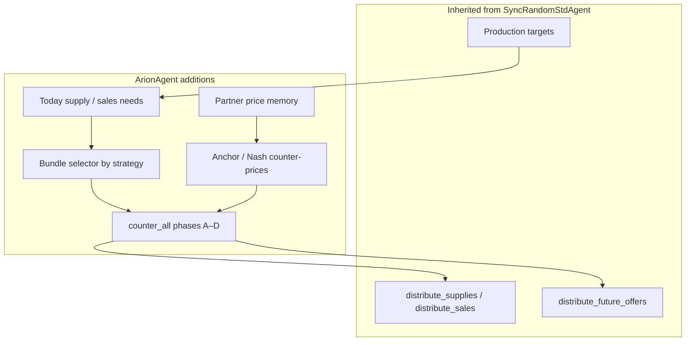
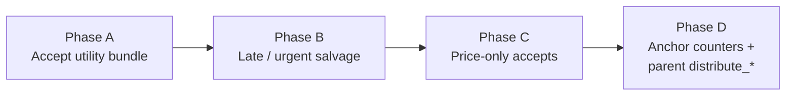
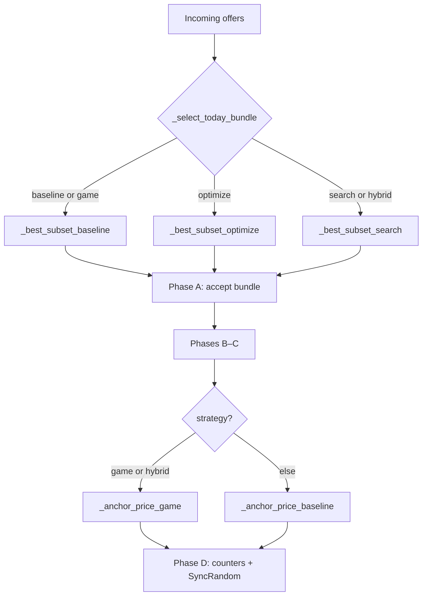
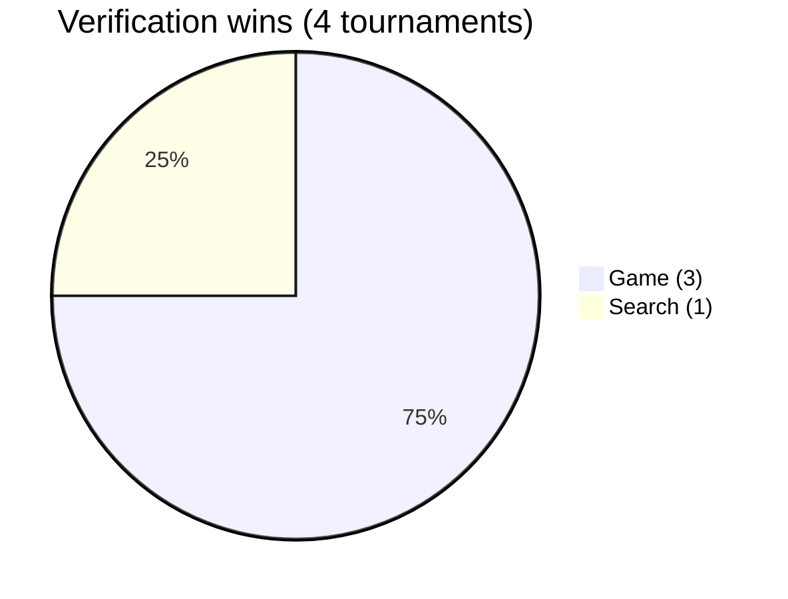

# ArionStrategists — SCML Standard Agent

**Course:** CS 451 / CS 551 Introduction to AI (Spring 2026)  
**Team:** Muhammad Raees Azam (S050683), Mehak Arshid (S050293)  
**Competition:** [ANAC 2026 SCML](https://anac.cs.brown.edu/scml), Standard track [[1]](#ref-1), [[2]](#ref-2)  
**Repository:** [github.com/roboraees07/ArionStrategists-ArionAgent](https://github.com/roboraees07/ArionStrategists-ArionAgent)

We built `ArionAgent` on top of SCML’s [`SyncRandomStdAgent`](https://scml.readthedocs.io/) [[4]](#ref-4). It keeps the parent’s production and distribution logic, then adds partner price memory, utility-aware bundle selection [[6]](#ref-6), and five switchable strategies. Negotiation runs through the usual SCML / NegMAS hooks [[3]](#ref-3), [[4]](#ref-4). For submission we ship **`game`** as the default—it held up best across our verification tournaments.

---

## Architecture overview



The bottom half of the diagram is stock SCML [[4]](#ref-4). Everything in the `ArionAgent` box is ours. When the strategy is `game` or `hybrid`, counter-offers use Nash-style reservation prices [[5]](#ref-5) instead of the baseline memory anchor.

---

## Negotiation pipeline (`counter_all`)

Regardless of strategy, `counter_all` walks the same four phases:



| Phase | When | What happens |
|-------|------|----------------|
| **A** | Today’s offers | Take a bundle from the strategy’s selector if utility clears the floor [[6]](#ref-6) and quantity covers today’s need |
| **B** | Urgent or late in the step | Salvage: cheap remaining input, strong sales offers |
| **C** | Standalone good deals | Accept via `good2buy` / `good2sell` [[4]](#ref-4) when they fit future needs |
| **D** | Everyone still open | Counter with an anchor (`game`/`hybrid` use Nash pricing [[5]](#ref-5)), then fall back to SyncRandom [[4]](#ref-4) |

Phases A–C try to lock in value early; Phase D is where we haggle on whatever’s left.

---

## Shared equations

Symbols below are plain text so they render cleanly on GitHub. The full write-up with LaTeX is in our project report. Utility notation matches SCML [[4]](#ref-4) and the framing in Russell & Norvig [[6]](#ref-6).

| Symbol | Meaning |
|--------|---------|
| L | Production lines (`n_lines`) |
| t | Current simulation step |
| tau | Relative time in [0, 1] |
| alpha_t | Production anchor: 0.42 normal, 0.58 urgent |
| U_max | Maximum utility (`ufun.max_utility`) [[4]](#ref-4), [[6]](#ref-6) |
| N_in | Today input (buy) quantity still needed |
| N_out | Today output (sell) quantity still needed |
| S_in | Inventory + secured input this step |
| I_t | Current input inventory |
| f | Utility floor fraction |
| sigma(B) | Lexicographic score tuple for bundle B |
| pi_res | Reservation unit price for counter-offer |

### Today needs

**Input (buy) need:**

```
N_in(t) = max( 0,
               floor(L * alpha_t) - S_in(t),
               needed_supplies )
```

**Sales (sell) need:**

```
N_out(t) = max( 0,
                min(L, floor(L * alpha_t) + I_t) - sales(t),
                needed_sales )
```

### Utility floor

```
if urgent:           f = 0.12
else:                f = 0.22
if tau > 0.78:       f = min(f, 0.08)

Accept bundle B only if:    U(B) >= f * U_max    # utility floor [6]
```

### Lexicographic subset score (optimize & search)

For bundle B with total quantity q and target need N:

```
sigma(B) = ( U(B),
             1 if q >= N else 0,
             -|q - N|,
             -q )

Pick largest sigma lexicographically.
Require:  q <= N + floor(0.15 * L)
```

### Nash-style reservation price (game & hybrid)

Counter-pricing borrows from Nash bargaining and reservation-price ideas [[5]](#ref-5). Given a partner’s range [m_n, m_x] and `mid = (m_n + m_x) / 2`:

```
t_blend = min(1, max(0, tau)) ^ 1.4

Buy side:
  pi_res = m_n + (mid - m_n) * (0.25 + 0.65 * t_blend)
  pi_res = min(pi_res, partner_best_buy + 1)   # if history exists

Sell side:
  pi_res = m_x - (m_x - mid) * (0.25 + 0.65 * t_blend)
  pi_res = max(pi_res, partner_best_sell - 1)  # if history exists
```

Clamp `pi_res` to [m_n, m_x], then use it in Phase D.

---

## Strategies

Five variants share the pipeline above; they differ in how they pick today’s bundle and how they set counter-prices.

| Key | Class | Bundle selection | Pricing / salvage |
|-----|-------|------------------|-------------------|
| `baseline` | `ArionAgentBaseline` | Exhaustive subsets (≤8 partners) or greedy by price | Memory-based anchor |
| `optimize` | `ArionAgentOptimize` | Maximize sigma over subsets | Memory-based anchor |
| `search` | `ArionAgentSearch` | Beam search (width 6) over ranked offers | Memory-based anchor |
| **`game`** | **`ArionAgentGame`** | Same as baseline | **Nash reservation counters** [[5]](#ref-5) |
| `hybrid` | `ArionAgentHybrid` | Beam search | Nash counters [[5]](#ref-5) + urgent salvage |



### Baseline

Partners are ranked by unit price—cheap inputs in, expensive outputs out. The agent tries every subset up to `MAX_SUBSET=8` partners and keeps the best bundle above the utility floor [[6]](#ref-6). If that fails, it greedily piles on offers until need is met. We treat this as the reference path; `game` reuses it for bundle choice.

### Optimize

Same search space as baseline, but the winner is the subset with the highest sigma: utility first, then whether need is covered, then how close quantity is to target. If nothing qualifies, it drops back to baseline. The point is to optimize several criteria at once instead of staring only at raw utility.

### Search

Beam search with width 6: start empty, add partners in price order, keep the six best partial bundles by sigma. Empty beam → baseline. You get more bundle diversity than greedy without enumerating all 2^n subsets.

### Game (what we submit)

Bundles come from baseline (stable, lower variance). Counters go through `_anchor_price_game`, which blends Nash reservation [[5]](#ref-5) with partner memory. That combination topped our verification runs and the full scoreboard, so it’s `DEFAULT_STRATEGY`.

### Hybrid

Search for bundles, game-style anchors for counters, and salvage triggers when the step is urgent—not only when time is almost gone. It can spike on favorable worlds but costs more runtime and swings harder run-to-run.

---

## Benchmark results

We ran local tournaments against SCML’s `SyncRandomStdAgent` and `GreedyStdAgent` [[2]](#ref-2), [[4]](#ref-4). Scoring is the league’s **mean normalized score**—higher is better [[2]](#ref-2).

### Full scoreboard

`arion_strategists/experiments/full_scoreboard.csv`:

| Rank | Agent | Mean score | Std | Shortfall | Storage |
|------|-------|------------|-----|-----------|---------|
| 1 | **ArionAgentGame** | **1.066** | 0.126 | 94.4 | 33.5 |
| 2 | ArionAgentHybrid | 1.048 | 0.197 | 66.0 | 38.4 |
| 3 | ArionAgent (default) | 1.036 | 0.205 | 113.1 | 46.5 |
| 4 | SyncRandomStdAgent | 1.020 | 0.058 | 64.4 | 37.2 |
| 5 | ArionAgentBaseline | 0.980 | 0.221 | 108.9 | 76.3 |
| 6 | ArionAgentOptimize | 0.974 | 0.176 | 105.6 | 50.3 |
| 7 | ArionAgentSearch | 0.934 | 0.226 | 165.8 | 61.6 |
| 8 | GreedyStdAgent | 0.737 | 0.280 | 195.2 | 158.2 |

```
Game     ████████████████████  1.066
Hybrid   ███████████████████   1.048
Arion    ██████████████████    1.036
SyncRand █████████████████     1.020
Baseline ████████████████      0.980
Optimize ████████████████      0.974
Search   ███████████████       0.934
Greedy   ███████████           0.737
```

`game` leads clearly; every Arion variant still beats Greedy by a comfortable gap.

### Verification tournaments (4 runs)

`arion_strategists/experiments/verification_runs.csv` — different step counts and world seeds each time:

| Run | Steps | Worlds | Winner | Game | Search | Hybrid | SyncRand | Greedy |
|-----|-------|--------|--------|------|--------|--------|----------|--------|
| 1 | 10 | 4 | Game | **1.060** | 0.968 | 1.044 | 0.967 | 0.640 |
| 2 | 15 | 6 | Game | **1.071** | 1.026 | 1.011 | 0.908 | 0.791 |
| 3 | 15 | 6 | Search | 1.064 | **1.083** | 1.000 | 1.020 | 0.744 |
| 4 | 12 | 6 | Game | **1.066** | 0.935 | 1.048 | 1.020 | 0.737 |

**Pooled over four runs:**

| Agent | Pooled mean | Rank-1 wins |
|-------|-------------|-------------|
| **ArionAgentGame** | **1.0652** | **3 / 4** |
| ArionAgentSearch | 1.0029 | 1 / 4 |
| ArionAgent (default) | 1.0441 | — |
| ArionAgentHybrid | 1.0256 | — |
| SyncRandomStdAgent | 0.9789 | — |
| GreedyStdAgent | 0.7281 | — |



`game` wins three of four; `search` takes the other. Hybrid looks strong on the big board but doesn’t pool as well here. `optimize` edges baseline slightly without catching `game`.

### Smoke tests

Short runs (5 steps, one world config) from `smoke_test_results.csv`—sanity checks, not leaderboard material:

| Strategy | Score | Shortfall | Time (s) | Status |
|----------|-------|-----------|----------|--------|
| game | 0.993 | 56.0 | 9.7 | PASS |
| default (game) | 0.993 | 56.0 | 9.6 | PASS |
| baseline | 0.974 | 51.4 | 10.4 | PASS |
| optimize | 0.974 | 51.4 | 11.0 | PASS |
| search | 0.974 | 51.4 | 9.9 | PASS |
| hybrid | 0.929 | 42.6 | 9.9 | PASS |

All strategies pass; absolute scores are lower only because the worlds are tiny.

---

## Repository layout

```
ArionStrategists/
├── README.md
├── requirements.txt
├── scripts/run_smoke.ps1
├── arion_strategists/
│   ├── arion_agent.py
│   ├── experiments/          # CSV results
│   └── helpers/
│       ├── runner.py
│       └── preflight.py
└── docs/REPORT.md
```

---

## Setup & run

Use the course venv at `scml_resources\std_local\.venv` if you have it:

```powershell
cd "c:\OZU-MS\Introduction to AI\Project\ArionStrategists"
& "c:\OZU-MS\Introduction to AI\Project\scml_resources\std_local\.venv\Scripts\Activate.ps1"
pip install -r requirements.txt
.\scripts\run_smoke.ps1
```

On Windows the first scipy/scml import can sit for **1–2 minutes**. Let it finish—killing the process mid-import just wastes time.

To re-run strategy comparison or pack a submission zip:

```powershell
python -m arion_strategists.helpers.runner compare-strategies 15 2
python -m arion_strategists.helpers.preflight
```

Try another strategy without editing code: `$env:ARION_STRATEGY="search"`

---

## ANAC submission

Upload through the [ANAC 2026](https://anac.cs.brown.edu/anac) portal [[1]](#ref-1), SCML Standard track [[2]](#ref-2). Running `preflight` produces `ArionStrategists_ArionAgent.zip`—agent module plus the minimal helpers ANAC expects, nothing else.

---

## References

Citations in the text use **[[n]](#ref-n)** and line up with `references.bib` in the LaTeX report.

<a id="ref-1"></a>

**[1]** ANAC Organizers. *Automated Negotiating Agents Competition (ANAC) 2026.* https://anac.cs.brown.edu/anac (accessed May 2026).

<a id="ref-2"></a>

**[2]** ANAC Organizers. *Supply Chain Management League (SCML).* https://anac.cs.brown.edu/scml (accessed May 2026).

<a id="ref-3"></a>

**[3]** Yasser, T. *NegMAS: Negotiation Multi-Agent System.* https://github.com/yasserfarouk/negmas (2024).

<a id="ref-4"></a>

**[4]** SCML Developers. *SCML documentation and world configurations.* https://scml.readthedocs.io/ (2024). Base class: [`SyncRandomStdAgent`](https://scml.readthedocs.io/).

<a id="ref-5"></a>

**[5]** Osborne, M. J. *An Introduction to Game Theory.* Oxford University Press, 2004.

<a id="ref-6"></a>

**[6]** Russell, S., and Norvig, P. *Artificial Intelligence: A Modern Approach*, 4th ed. Pearson, 2020.

---

## Report & acknowledgments

The full paper—methods, pseudocode, every table, BibTeX sources—is in `../ArionAgent_Report_Complete/` (`main.tex`, pdfLaTeX + BibTeX).

`ArionAgent` extends `SyncRandomStdAgent` from SCML [[4]](#ref-4) and NegMAS [[3]](#ref-3). We did not copy any third-party competition agent code. LLM help with drafting and implementation is documented in report §9; we reviewed and tested everything ourselves.
