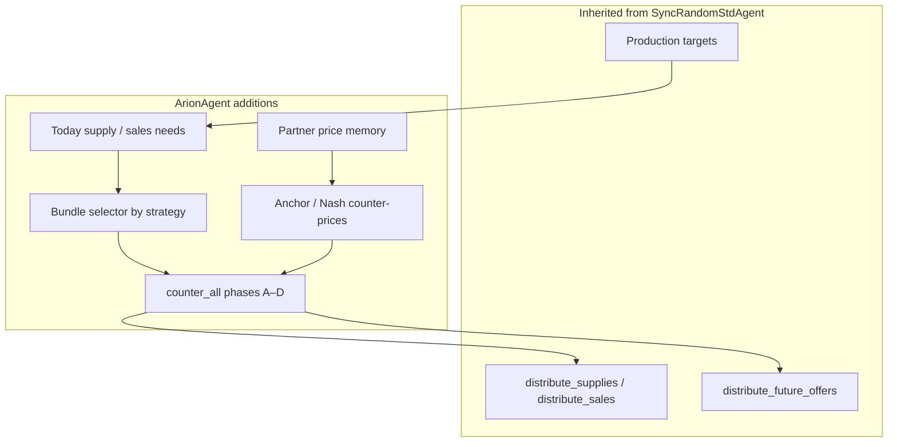
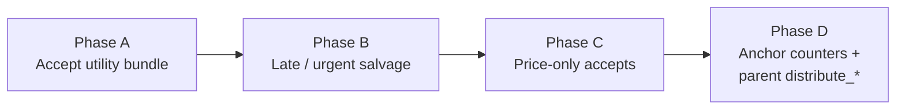
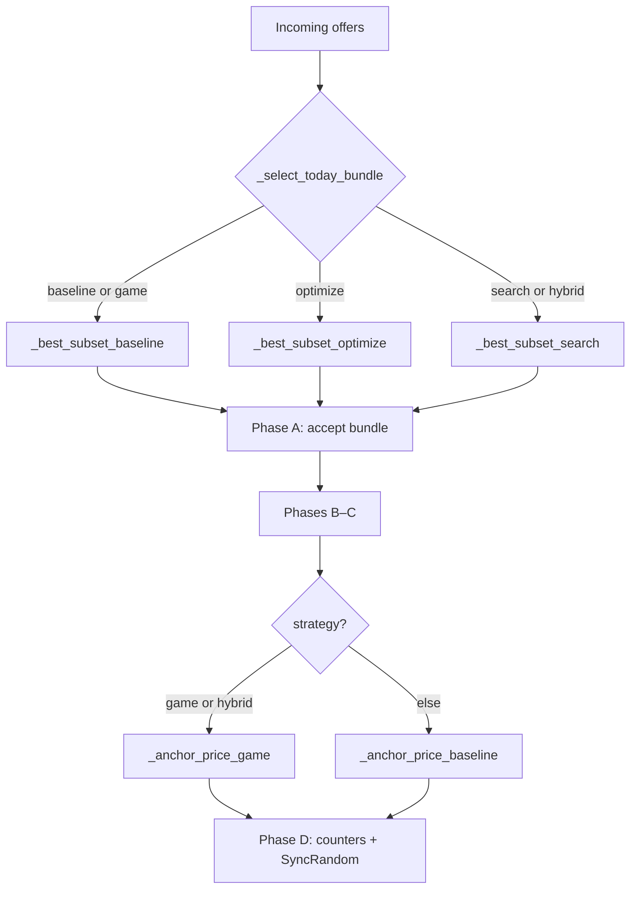
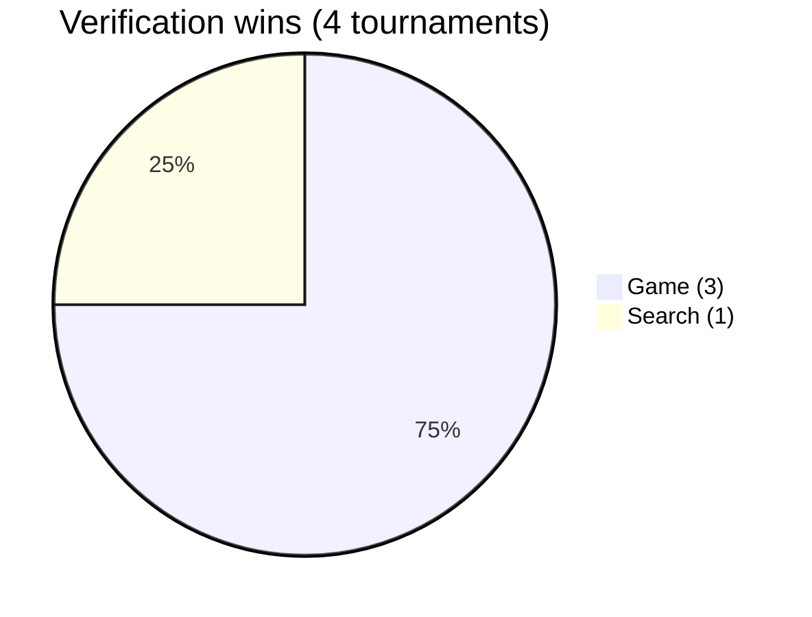

# ArionStrategists — SCML Standard Agent

**Course:** CS 451 / CS 551 Introduction to AI (Spring 2026)  
**Team:** Muhammad Raees Azam (S050683), Mehak Arshid (S050293)  
**Competition:** [ANAC 2026 SCML](https://anac.cs.brown.edu/scml) (Standard track)  
**Repository:** [github.com/roboraees07/ArionStrategists-ArionAgent](https://github.com/roboraees07/ArionStrategists-ArionAgent)

`ArionAgent` extends [`SyncRandomStdAgent`](https://scml.readthedocs.io/) with partner memory, utility-aware bundles, and five selectable strategies. The **submitted default** is **`game`** (best pooled score on our verification tournaments).

---

## Architecture overview



---

## Negotiation pipeline (`counter_all`)

Every strategy uses the same four-phase response order:



| Phase | When | Action |
|-------|------|--------|
| **A** | Today’s offers | Accept subset from bundle selector if utility ≥ floor and quantity covers need |
| **B** | Urgent or late step | Accept cheapest remaining input / best sales to fill gaps |
| **C** | Good single offers | Accept by `good2buy` / `good2sell` and future needs |
| **D** | Remaining partners | Counter with anchor price (game/hybrid) then inherited SyncRandom logic |

---

## Shared equations

Let $L$ = production lines, $\tau$ = relative simulation time, $U_{\max}$ = max utility.

### Today needs

Input (buy) need for current step $t$:

$$
N^{\mathrm{in}}_t = \max\bigl(0,\; \lfloor L\alpha_t \rfloor - S^{\mathrm{in}}_t,\; \texttt{needed\_supplies}\bigr)
$$

Sales (sell) need:

$$
N^{\mathrm{out}}_t = \max\bigl(0,\; \min(L,\lfloor L\alpha_t \rfloor + I_t) - \texttt{sales}_t,\; \texttt{needed\_sales}\bigr)
$$

Production anchor $\alpha_t \in \{0.42,\; 0.58\}$ (normal vs urgent).

### Utility floor

Fraction $f \in \{0.22,\; 0.12,\; 0.08\}$ (normal / urgent / late). Accept only if:

$$
U(\mathcal{B}) \geq f \cdot U_{\max}
$$

### Lexicographic subset score (optimize & search)

For bundle $\mathcal{B}$ with total quantity $q$ and target need $N$:

$$
\sigma(\mathcal{B}) = \bigl(U,\; \mathbb{1}[q \geq N],\; -|q-N|,\; -q\bigr)
$$

Maximize $\sigma$ lexicographically; require $q \leq N + \lfloor 0.15\,L \rfloor$.

### Nash-style reservation price (game & hybrid)

On price interval $[m_n, m_x]$, midpoint and time blend:

$$
\pi_{\mathrm{res}} = m_n + (\tfrac{m_n+m_x}{2} - m_n)\cdot(0.25 + 0.65\,\tau^{1.4}) \quad \text{(buy side sketch)}
$$

Clamp with partner memory (best buy/sell seen this step).

---

## Strategy methods (how each works)

| Key | Class | Bundle selection | Pricing / salvage |
|-----|-------|------------------|-------------------|
| `baseline` | `ArionAgentBaseline` | Exhaustive subsets (≤8 partners) or greedy by price | Memory-based anchor |
| `optimize` | `ArionAgentOptimize` | Maximize $\sigma$ over subsets | Memory-based anchor |
| `search` | `ArionAgentSearch` | Beam search (width 6) over ranked offers | Memory-based anchor |
| **`game`** | **`ArionAgentGame`** | Same as baseline | **Nash reservation counters** |
| `hybrid` | `ArionAgentHybrid` | Beam search | Nash counters + urgent salvage |



### 1. Baseline

- Ranks partner offers by unit price (cheap input, expensive output).
- Tries all subsets up to `MAX_SUBSET=8` partners; keeps best utility above floor.
- Falls back to greedy accumulation until need is met.
- **Role:** Reference implementation; also used inside `game` for bundles.

### 2. Optimize

- Same search space as baseline but picks the subset with highest $\sigma$ (utility, then need coverage, then quantity gap).
- Falls back to baseline if no valid subset.
- **Idea:** Explicit multi-criteria optimization instead of raw utility only.

### 3. Search

- Beam search: start with empty bundle, add partners in price order, keep top 6 partial bundles by $\sigma$.
- Falls back to baseline if beam ends empty.
- **Idea:** Explore multiple bundle compositions without full $2^n$ enumeration.

### 4. Game (submission default)

- **Bundles:** baseline (stable, lower variance).
- **Counters:** `_anchor_price_game` uses Nash reservation + partner memory.
- **Why default:** Best mean score on verification runs (see below).

### 5. Hybrid

- **Bundles:** search.
- **Counters:** game anchors.
- **Salvage:** also when urgent (not only late).
- **Trade-off:** Strong on some boards, higher runtime and variance.

---

## Benchmark results

Opponents in all tournaments: `SyncRandomStdAgent`, `GreedyStdAgent`.  
Metric: **mean normalized score** (higher is better).

### Full scoreboard (consolidated)

From `arion_strategists/experiments/full_scoreboard.csv`:

| Rank | Agent | Mean score | Std | Shortfall | Storage |
|------|-------|------------|-----|-----------|---------|
| 1 | **ArionAgentGame** | **1.066** | 0.126 | 94.4 | 33.5 |
| 2 | ArionAgentHybrid | 1.048 | 0.197 | 66.0 | 38.4 |
| 3 | ArionAgent (default) | 1.036 | 0.205 | 113.1 | 46.5 |
| 4 | SyncRandomStdAgent | 1.020 | 0.058 | 64.4 | 37.2 |
| 5 | ArionAgentBaseline | 0.980 | 0.221 | 108.9 | 76.3 |
| 6 | ArionAgentOptimize | 0.974 | 0.176 | 105.6 | 50.3 |
| 7 | ArionAgentSearch | 0.934 | 0.226 | 165.8 | 61.6 |
| 8 | GreedyStdAgent | 0.737 | 0.280 | 195.2 | 158.2 |

**Score comparison (full scoreboard):**

```
Game     ████████████████████  1.066
Hybrid   ███████████████████   1.048
Arion    ██████████████████    1.036
SyncRand █████████████████     1.020
Baseline ████████████████      0.980
Optimize ████████████████      0.974
Search   ███████████████       0.934
Greedy   ███████████           0.737
```

### Four verification tournaments

From `arion_strategists/experiments/verification_runs.csv`:

| Run | Steps | Worlds | Winner | Game | Search | Hybrid | SyncRand | Greedy |
|-----|-------|--------|--------|------|--------|--------|----------|--------|
| 1 | 10 | 4 | Game | **1.060** | 0.968 | 1.044 | 0.967 | 0.640 |
| 2 | 15 | 6 | Game | **1.071** | 1.026 | 1.011 | 0.908 | 0.791 |
| 3 | 15 | 6 | Search | 1.064 | **1.083** | 1.000 | 1.020 | 0.744 |
| 4 | 12 | 6 | Game | **1.066** | 0.935 | 1.048 | 1.020 | 0.737 |

**Pooled averages (4 runs):**

| Agent | Pooled mean | Rank-1 wins |
|-------|-------------|-------------|
| **ArionAgentGame** | **1.0652** | **3 / 4** |
| ArionAgentSearch | 1.0029 | 1 / 4 |
| ArionAgent (default) | 1.0441 | — |
| ArionAgentHybrid | 1.0256 | — |
| SyncRandomStdAgent | 0.9789 | — |
| GreedyStdAgent | 0.7281 | — |



### Smoke tests (quick correctness)

Short worlds (5 steps, 1 config) — from `smoke_test_results.csv`:

| Strategy | Score | Shortfall | Time (s) | Status |
|----------|-------|-----------|----------|--------|
| game | 0.993 | 56.0 | 9.7 | PASS |
| default (game) | 0.993 | 56.0 | 9.6 | PASS |
| baseline | 0.974 | 51.4 | 10.4 | PASS |
| optimize | 0.974 | 51.4 | 11.0 | PASS |
| search | 0.974 | 51.4 | 9.9 | PASS |
| hybrid | 0.929 | 42.6 | 9.9 | PASS |

Smoke scores are **not** directly comparable to full tournaments (fewer steps/seeds); they confirm all strategies run without errors.

### Conclusion from benchmarks

1. **`game`** — best pooled verification mean (1.0652) and top of full scoreboard → **chosen as `DEFAULT_STRATEGY`**.
2. **`hybrid`** — second on full board; lower verification pooled mean; useful experimentally.
3. **`search`** — wins one verification run but higher shortfall on full board.
4. **`optimize`** — slight gain over baseline on full board but below game.
5. All Arion variants beat **`GreedyStdAgent`** by a wide margin.

---

## Repository layout

```
ArionStrategists/
├── README.md
├── requirements.txt
├── scripts/run_smoke.ps1
├── arion_strategists/
│   ├── arion_agent.py
│   ├── experiments/          # CSV results
│   └── helpers/
│       ├── runner.py
│       └── preflight.py
└── docs/REPORT.md
```

---

## Setup & run

**Recommended:** course venv at `scml_resources\std_local\.venv`

```powershell
cd "c:\OZU-MS\Introduction to AI\Project\ArionStrategists"
& "c:\OZU-MS\Introduction to AI\Project\scml_resources\std_local\.venv\Scripts\Activate.ps1"
pip install -r requirements.txt
.\scripts\run_smoke.ps1
```

**First run:** scipy/scml import can take **1–2 minutes** on Windows — wait; do not Ctrl+C.

**Benchmarks:**

```powershell
python -m arion_strategists.helpers.runner compare-strategies 15 2
python -m arion_strategists.helpers.preflight
```

Override strategy: `$env:ARION_STRATEGY="search"`

---

## ANAC submission

Preflight builds `ArionStrategists_ArionAgent.zip` (agent module + minimal helpers only).

---

## Report & acknowledgments

- Full LaTeX report: `../ArionAgent_Report_Complete/` (equations, pseudocode, all tables).
- Base planner: `SyncRandomStdAgent` (SCML / NegMAS).
- LLM use disclosed in report §9; code reviewed by authors.
- No third-party competition agent source used.
